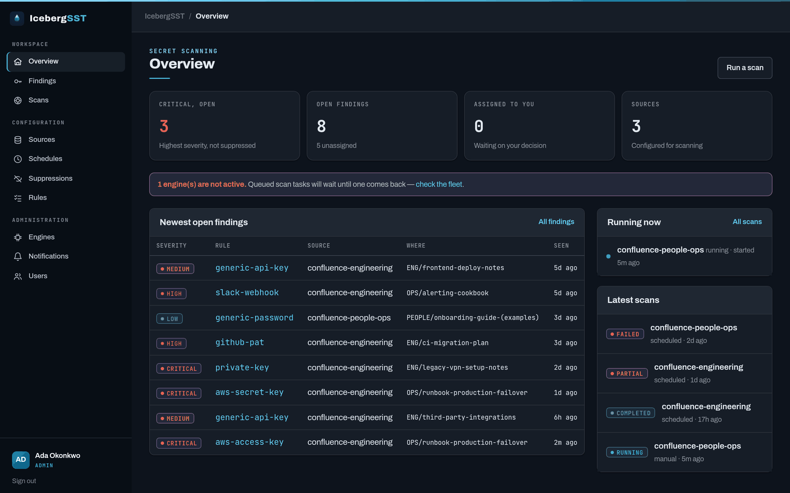

# IcebergSST

**Iceberg Secret Scanning Tool** — a secret-scanning platform for finding passwords and other
secrets that have been inappropriately stored across enterprise systems.

Most secret-scanning tooling is git-centric. IcebergSST targets the *non-git* long tail where
credentials quietly accumulate — **Confluence**, **Jira**, and **network file shares** — with an
API-first management plane and horizontally scalable, isolated scanner engines.

> ⚠️ **Status: M0–M3 built.** The core package, the control-plane API, the detection engine, the
> Confluence connector, the engine worker, the local container stack, and the web console all exist
> and are tested. Notification *dispatch* and the Helm chart (M4) do not yet. See
> [`ARCHITECTURE.md`](./ARCHITECTURE.md) and [`docs/`](./docs/) for the spec, and the GitHub
> milestones/issues for what is left.

## The console


Server-rendered HTML driven by HTMX and Alpine, under a strict Content-Security-Policy. It is a
client of the same API routes documented in [`docs/api.md`](./docs/api.md) — not a second
implementation of them. Dark mode follows the operating system.

<details>
<summary><b>More screens</b> — findings and triage, live scan status, sources, the engine fleet, dark mode</summary>

<br>

**Findings.** Every filter is part of the URL and is sent to the API as written, so the rows always
reconcile with the query above them.


**A finding, and why it is in the state it is in.** The snippet was masked inside the engine before
it ever crossed the wire; the database has never held the secret. The history below the triage panel
is the `FindingEvent` trail.


**A scan in flight.** The status region polls itself every three seconds and stops when the scan
reaches a terminal state — the browser never has to know which statuses those are.


**A source.** The credential is write-only at the API, so the form has nothing to echo back — it
reports that one is stored and offers to replace it.


**The fleet.** Engines hold no database credentials. When a rolling deploy leaves two rule-pack
versions in force, the page says so rather than picking one.


**Dark mode** is the same token set with dark surfaces — no toggle, no cookie, and no inline
bootstrap script (which the CSP would forbid anyway).



</details>

> Screenshots are of fabricated demo data on a local instance. Every snippet shown is already
> masked, because that is the only form the database can hold.

## What it does

- **Discover & scan** content in Confluence (MVP), with Jira and SMB/NFS file shares to follow.
- **Detect** secrets with a custom regex + entropy + keyword-proximity engine driven by
  versioned rule packs.
- **Never store plaintext** — findings keep only a redacted snippet and a salted fingerprint
  hash.
- **Triage** findings through a lifecycle (open → false-positive / accepted-risk / resolved) with
  an audit trail, suppressions/allowlists, and notifications.
- **Re-scan reconciliation** — a stable per-finding fingerprint means triage decisions persist
  across scans; resolved secrets that reappear re-open, and secrets that vanish auto-resolve.

## Architecture at a glance

| Layer | Technology |
|-------|------------|
| Control-plane API | FastAPI (API-first; OpenAPI is the contract) |
| ORM / database | SQLModel over PostgreSQL |
| Web console | Server-rendered Jinja + HTMX + Alpine, under a strict CSP ([`docs/web.md`](./docs/web.md)) |
| Job queue | Redis + Dramatiq |
| Scanner engines | Separate Dramatiq worker processes; consume jobs from Redis, **POST results back to the API** (no database credentials) |
| Auth | OIDC/SSO + RBAC (admin / analyst / viewer) |
| Runtime | Python 3.14, containers (docker-compose for dev, Helm for prod) |

See [`ARCHITECTURE.md`](./ARCHITECTURE.md) for the full picture and
[`docs/adr/`](./docs/adr/) for the rationale behind each decision.

## Quickstart

Needs [uv](https://docs.astral.sh/uv/) and Docker.

```bash
make init-env   # .env from .env.example, with a master key and sealed pepper generated
make up         # build, start api + engine + postgres + redis, wait for health, migrate
make seed       # optional: a disabled demo source to click around
make scale N=3  # more engine replicas
make down       # stop; `make destroy` also drops the data volume
```

The console is then at <http://localhost:8000/> and the OpenAPI docs at `/docs`. Signing in needs
OIDC configured in `.env`; the first person to sign in lands as a viewer unless
`ICEBERG_BOOTSTRAP_ADMIN_SUBJECT` names them.

`make check` runs what CI runs: `ruff`, `mypy`, and `pytest`. `make help` lists every target.

## Repository layout

```
apps/api        FastAPI control plane
apps/engine     Dramatiq scanner worker
packages/core   shared models, config, secret-store, fingerprinting, redaction
packages/detect rule packs + detection engine
packages/connectors  connector interface + Confluence (Jira/SMB later)
apps/api/…/web  the console: Jinja templates, Alpine components, design system
web/            frontend asset vendoring (no Node toolchain)
deploy/compose  docker-compose development stack
deploy/docker   role Dockerfiles (api, engine)
deploy/helm     Helm chart (M4)
docs/           design spec, ADRs, threat model
tests/          cross-cutting invariants (deployment boundaries)
```

## License

See [`LICENSE`](./LICENSE).
